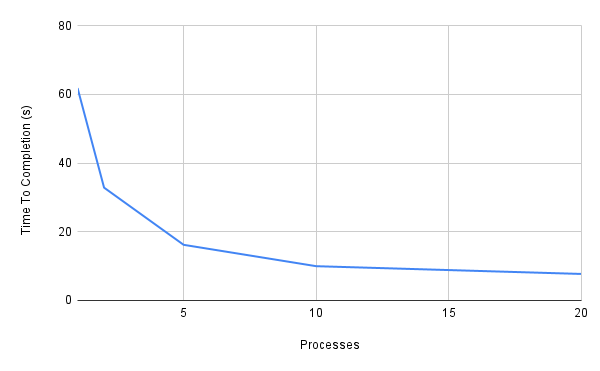

# System Programming Lab 11 Multiprocessing
## Implementation
The program takes in an argument for how many processes the user would like to run. (default: 1)

It then forks until the given number of processes are created, and waits for one to die off before producing more.

Each process handles and creates one mandelbrot image before exiting, each one scaled progressively to "zoom in". 

The best video is produced by the following parameters:

`./mandel -n 50 -x -0.1 -y 0.1`
## Results

The use of 1, 2, 5, 10, and 20 processes produces a runtime of 61.814, 32.828, 16.189, 9.969, and 7.711 seconds respectively.

The benefits of more processes evidently drops off sharply after 5 processes.